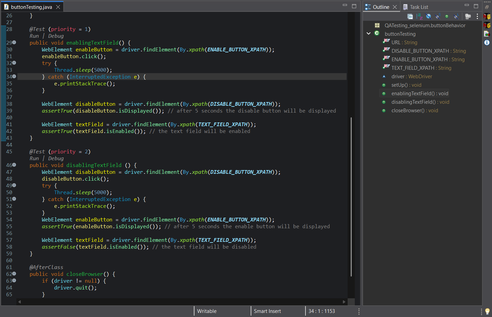
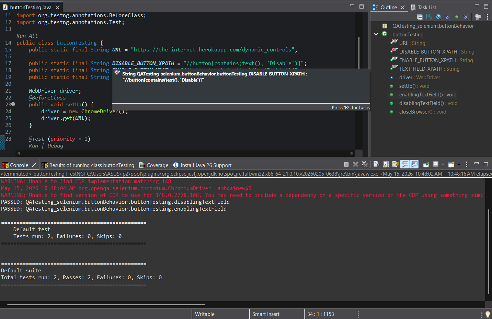

# Button Behavior Assignment

This is my QA testing assignment using Selenium and TestNG to check if a text field is enabled or disabled on a website.

## Structure

I split the code instruction into two test cases:

1. **Enabling Text Field**: This test case checks if the text field is enabled after clicking the enable button.
2. **Disabling Text Field**: This test case checks if the text field is disabled after clicking the disable button.

## Screenshots

Here is a screenshot of my code:

[Test Code](src/test/java/QATesting_selenium/buttonBehavior/buttonTesting.java)

Here is a screenshot of the test run:

## How to Run

You can run the test file `buttonTesting.java` as a TestNG test in Eclipse
